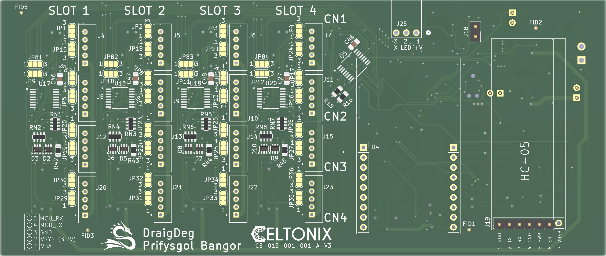
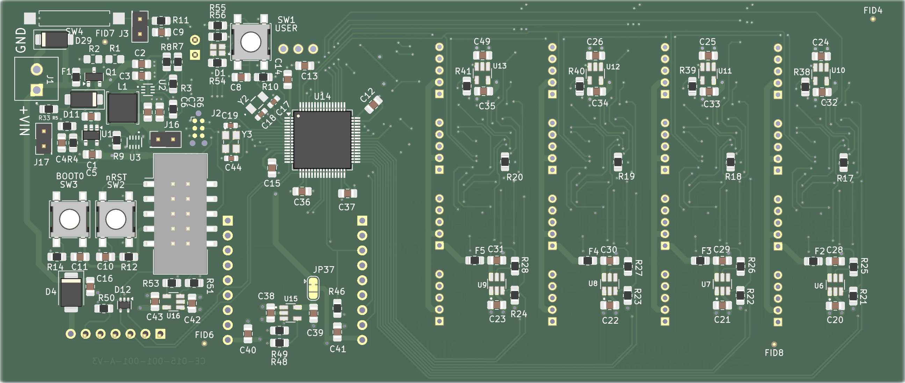
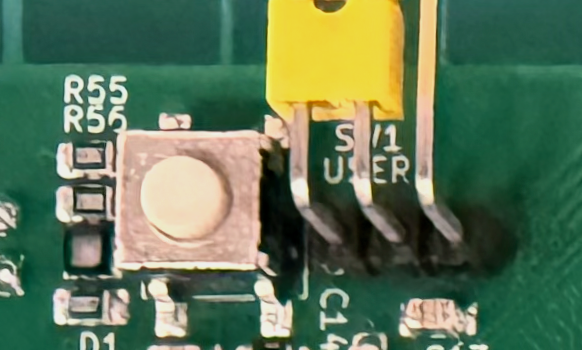

# Controller Overview

**Front**

**Back**

## Aims & Objectives

* Allow the simple creation of any sensor application via external hardware modules
* Manage battery power effectively for low-power high-endurance sensor projects. 
* Provide long-range connectivity.
* Easy to deploy and manage in the field.

## Features

### Hardware Features

* Managed Power Domains
* Multiplexed Module Communications
* Optional Bluetooth diagnostics
* Flexible wireless options

### User Features

* Magnet/reed-switch based debug modes
* Button sample trigger
* Jumpered LED indicator for power saving

## Modules

For a detailed description of how modules can be constructed, please see [Modules Overview](../04_modules/module_overview.md).

The platform does everything except gather sensor readings or interact with instruments. 
That's the task of custom modules that should be easy to produce. 

What the controller does do however is orchestrate the power availability to modules and communicate with them to perform sensor data aquisition. 

**Slots & Ports**

The controller has multiple ports (16 for a fully populated V3). 
A port is a power and communications link to a module. 
It's a phyical connection: A JST PH2 5-way pin header.

Modules are arranged into 4 power slots each with 4 ports.
When in standby mode, modules do not have any power available. 
During an active loop...
Power is activated by slot (4 ports get power at the same time) then the controller accesses the modules on the ports of this power slot sequentially. 
A slot is depowered, those modules are powered down, then the next slot is energised. 
The modules perform their work and the controller keeps the data they emitted. 

Having multiple slots means the power delivery capability (circa 2Amps) is not spiked for all modules and the user can balance the power distribution over multiple slots. 

**Module Communication**

The means of talking from controller to module is over a standard UART at 9600baud (8/N/1)

The controller can multiplex 16 UARTS into its own single module communications UART. Switching slots and ports at runtime. 

The controller-to-module communications protocol is request-response in nature and is all done using human readble ASCII text transfers. 

Modules are free to do whatever electronics, sampling, and processing they need to and ultimately encode their values back to the controller. 

Modules and their potentially multiple channels of sensor data are self describing (data type, and binary encoding). 

At controller start time, it sequences through the all the potential module ports and records which ports are occupied. 
This startup check requests configuration from each modules that describes the arrangments of sensors it may have. 

Later at periodic intervals, the controller requests sensor data from each module which it subsequently transmits. 

These two exchanges follow an ASCII exchange protocol, however there is an Arduino module library to encapsulate this protocol to a simple C/C++ programming API.

More detail is explained in the [Modules Documentation](../04_modules/module_overview.md).

## Power Managment

Various power domains are managed on the controller for different objectives. 

* VBAT - The power channel directly from the power source - typically a battery at whatever voltage it happens to be exhibiting.  VBAT is distributed via load switches to each slot.  
* VLDO - A LDO regulated power channel at 3.2 volts. 
* VSYS - A Buck convertor regulated power channel providing 3.3v that is used for powering slots and other peripherals that have their power controlled programmatically. The buck convertor is switched programmatically, powering/depowering all the peripherals connecting to the controller. 
* VMCU - This supplies permanent power to the MCU and - by default - the RF comms "Bee" module. VMCU is actually the higher of VLDO or VSYS - meaning it will take power from the buck if it is active, otherwise from the LDO.  
* A solder bridge for the RFBee power connection means that if a different type of module were used - such as WiFi - this can be load switch if necessary. 

## User interface

**LED** an RGB LED triplet (D1) provides user feedback.  LEDs consume too much current for sustained use, so the nearby jumper (J25, Top edge) can enable/disable the LED when the operator is actually looking at the device in action. 

**User Button** The User button (SW1 User) wakes the controller from deep sleep for a 1-shot periodic sample, gather and transmit of all connected modules. 

**Reed Switch** The reed-switch footprint at SW4 or the pin header at J3 - both on the top edge - provide the operator with a debug mode that can be enabled/disabled with a magnet. 

**Reset Button** The reset button resets the hardware 

**BOOT Mode Button** The Boot button puts the MCU into a reflashing state. when it is held down at the same time RESET is pushed. 

