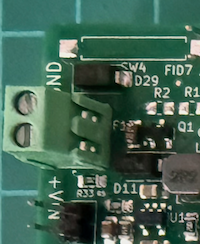
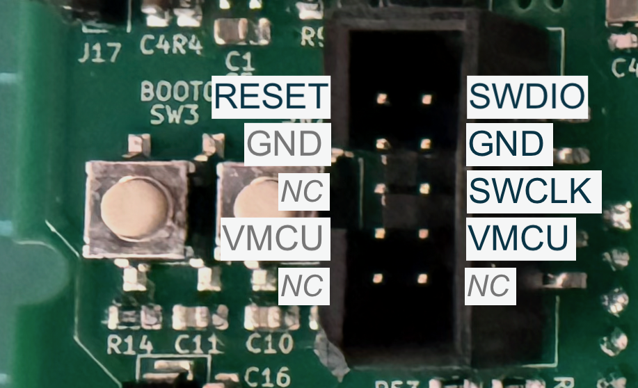
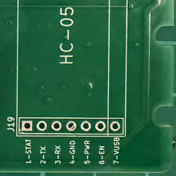

# Controller Programming

## Hardware Setup

### Power

The board will accept a voltage range of 3.4v to 12v - but we stipulate that 6v is the suggested max as this is distributed via VBAT. 

Power is typically applied through the power input J1 - A 2-pin terminal screw, top left of the back side of the board.

Polarity is important - there is polarity protection, but it won't power up if the polarity is mismatched.

* GND at the terminal closer to the top edge.
* V+ 

Power can also be introduced via the VBAT pin (pin-7) of HC-05 connector on the right of the front of the board. 
This pin is not part of the HC-05 but is conveniently positioned to allow the controller to be powered from a compatible USB-to-serial adapter.

_(Coming soon - we've made an adapter shim to accept a typical USB-to-serial port and replicate the HC-05 pinout, in addition to supplying power via this VBAT pin.)_

### Programming Cable and Programmer

The controller is based around an STM32 microcontroller. 

These controllers are programmed using a variety of protocols but we have exposed connections for the SWD protocol on the controller board. 

An IDC header on the front exposes the SWD pins for use with a variety of programmers.

In addition, for those with fancier gear, there is a Tag-Connect TC2030 footprint at J2. 

### Serial Port output

The controller firmware emits debugging and diagnostic messaging on its default serial port. 

This is exposed on the controller board using the footprint of an HC-05 bluetooth transceiver at J19
Bluetooth with an HC-05 can be used interchangably with the serial port. 

**Setup (A) - USB-to-serial**

For a regular USB-to-Serial adapter (E.g. FTDI, CH340, CP2102 etc) three connections are required

* pin-2 - Couple the TX line at pin-2 to the RX input of your serial port adapter.
* pin-3 - Couple the RX line at pin-3 to the TX output of your serial port adapter.
* pin-4 - Couple the GND line at pin-4 to the GND on your serial port adapter.

**Setup (B) - HC-05**

**NOTE** The HC-05 has only 6 pins and must be connected using the first 6 pins on J19 (1-6) 

(7 is reserved for an alternate power input)

**Setup (C) - DraigDeg Serial port adapter**

Our custom serial port adapter (pending) will use all 7 pins and supply power. 

### IDE setup

TBC

