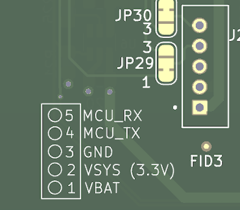
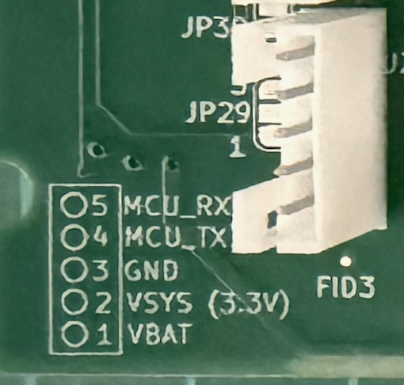
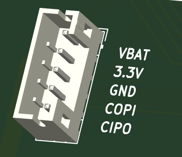
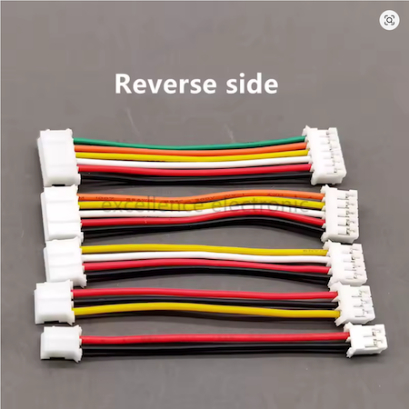

# Modules

Modules are the flexible way of introducing sensors and instruments to a DraigDeg IoT project. 

## Basics

A module requires at least a small microcontroller to interface back to the controller via a UART. 
You can use any microcontroller that you are comfortable programming as long as it has a UART that you can couple to the controller's port. 

In our template, you'll see we've used the Seeeduino Xiao RP2040 for our reference design. 
These are very cost effective and powerful and easy to program. 
But you don't need to stick with this: any of the cheap Atmel AVR Arduino's are suitable (Pro-mini, Nano, AT-Tiny etc) or you can use something fancier. 

Apart from the requirement to provide a UART interface, you can use any electronics and components you like to get you sensors integrated. 

## Hardware

The only hardware requirement is to interface to one of the controllers ports. 

### Connection

On the controller's side this is a [JST PH2 pin header](https://duckduckgo.com/?q=JST_B5B-PH-K-S). 

Here is the layout of the controller's port. 

 

Here you can see the mating orientation of the JST PH2 pin header.

| Pin | Name | Purpose |
|-----|------|---------|
|  1  | VBAT | Switched RAW battery voltage |
|  2  | 3V3  | Switched regulated power at 3.3v |
|  3  | GND  | Ground |
|  4  | MCU_RX (COPI) | UART Controller-In / Peripheral-Out. Controller's RX line, Module's TX line.  |
|  5  | MCU_TX (CIPO) | UART Controller-Out / Peripheral-In. Controller's TX line, Module's RX line. |

We have used the same layout on our reference module, using the same connector part, and using the same pin arrangement.

Below we can see the connector we have used on our reference module.  It is the same pin arrangement, but rotated on the board so the mating notch faces the other direction and has pin 1 at the top. 

:::warning

In our reference module, with the same connector, and the same pin arrangement, we must use **REVERSED** cables to present the same arrangement on both end, with matching straight through pins.  Pay attention to these details. 

:::

Here is an example of the reversed cable assembly (albeit _way_ too short :) ) which means we can use the same connector layout on both module and controller. 

**Obviously, you are free to layout your modules however you like! The above just happens to be how we've done it, in order to use cost-effective components**

## Addresses

:::info 
TL;DR you can ignore addressesing altogether if you use the module library. 
:::

The modules are connected to ports, that are in slots. 
The current design uses a physical addressing structure, which is practically irrelavent.  It is part of the protocol so we may consider logical addressing, for different comms busses in the future. 

The controller will encode the port & slot in a request, which a module must respond with.  The library handles this so you can ignore it. It just passes the same address back. Here are the addresses that will be issued.  If (for some reason) you want to know inside your module's code which slot and port it is at, then here is the value that will be passed in request messages.  

The slot is encoded into the first nibble (most significant 4 bits) and the port is in the lowwer nibble (least significant 4 bits)

| Slot | Port | Target Address |
| ---- | ---- | -------------- |
|    1 |    1 |             17 |
|    1 |    2 |             18 |
|    1 |    3 |             19 |
|    1 |    4 |             20 |
|    2 |    1 |             33 |
|    2 |    2 |             34 |
|    2 |    3 |             35 |
|    2 |    4 |             36 |
|    3 |    1 |             49 |
|    3 |    2 |             50 |
|    3 |    3 |             51 |
|    3 |    4 |             52 |
|    4 |    1 |             65 |
|    4 |    2 |             66 |
|    4 |    3 |             67 |
|    4 |    4 |             68 |

## Software

In addition to create software routines to interact with your sensor hardware, your module's code also needs to interact with the controllers requests which are sent over the UART. 

You can implement the protocol yourself. It is described here: [Wire Protocol](../03_details/PROTOCOL.md)

But if you are using the Arduino runtime (In either Arduino IDE or PlatformIO) we have published a library which handles the protocol for you. 

See the [Module Library](./module_library.md) guide for a detailed description.

### Protocol in brief

For those who want the quick details, here is an exchange with the controller requesting all sensor values using text command `RA0`. This excerpt is taken from the [Wire Protocol](../03_details/PROTOCOL.md) document. 

See all the other documents in the details section for further low level descriptions

The following full example requests all data `RA0` from the module with logical address 35. (Slot 2, Port 3) It responds with a single channel providing temperature `1` using encoding `42` and humidity `2` using encoding `41` (See [Encodings](../03_details/DATA_ENCODING.md) for what these values mean)

**Request** from controller

    `?3,RA0\n`

**Response** from module

    `!3,RA0,1,2,1_42[-10.2],2_41[67.5]\n`

| chars  | meaning |
| ------ | ------- |
|    `!` | response |
|    `3` | module 3 responding |
|  `RA0` | responding to command `RA0` |
|    `1` | Channel 1 data follows |
|    `2` | two measurements follows |
| `1_42` | temperature (1) should be encoded using format 42 |
| `[-10.2]` | the temperature reading -10.2°C
| `2_41` | humidity {2} should be encoded using format {41} |
| `[67.5]` | the humidity reading |

